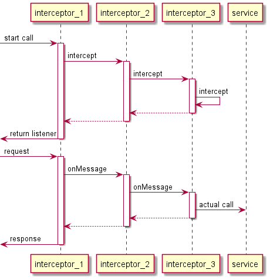
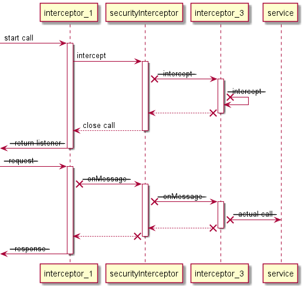
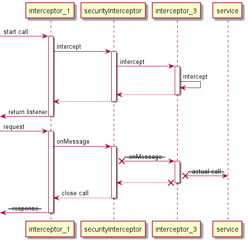

= Spring boot starter for http://www.grpc.io/[gRPC framework.]
ifdef::env-github[]
:tip-caption: :bulb:
:note-caption: :information_source:
:important-caption: :heavy_exclamation_mark:
:caution-caption: :fire:
:warning-caption: :warning:
endif::[]
:toc:

image:https://img.shields.io/maven-central/v/io.github.lognet/grpc-spring-boot-starter.svg?label=Maven%20Central[link=https://search.maven.org/search?q=g:%22io.github.lognet%22%20AND%20a:%22grpc-spring-boot-starter%22]
image:https://app.travis-ci.com/LogNet/grpc-spring-boot-starter.svg?branch=master["Build Status", link="https://app.travis-ci.com/LogNet/grpc-spring-boot-starter"]
image:https://codecov.io/gh/LogNet/grpc-spring-boot-starter/branch/master/graph/badge.svg["Codecov",link="https://codecov.io/gh/LogNet/grpc-spring-boot-starter/branch/master"]
Best viewed with image:https://www.octotree.io/_nuxt/img/03e72a3.svg["Octoree",width="24", link="https://www.octotree.io"]

:toc:
:source-highlighter: prettify
:numbered:
:icons: font

== Features

Autoconfigures and runs the embedded gRPC server with @GRpcService-enabled beans as part of spring-boot application (https://github.com/LogNet/grpc-spring-boot-starter/blob/master/images/demo.gif[short video])

== Setup

[IMPORTANT]
Make sure to check out the link:./grpc-spring-boot-starter-gradle-plugin/README.adoc[io.github.lognet.grpc-spring-boot^]   gradle plugin that dramatically simplifies the project setup.

[source,groovy]
----
repositories {
  mavenCentral()
  // maven { url "https://oss.sonatype.org/content/repositories/snapshots" } // for snapshot builds
}
dependencies {
  compile 'io.github.lognet:grpc-spring-boot-starter:5.1.2'
}
----

By default, starter pulls `io.grpc:grpc-netty-shaded`   as transitive dependency, if you are forced to use pure `grpc-netty` dependency:

[source,groovy]
----
compile ('io.github.lognet:grpc-spring-boot-starter:5.1.2') {
  exclude group: 'io.grpc', module: 'grpc-netty-shaded'
}
compile 'io.grpc:grpc-netty:1.55.1' // <1>
----
<1> Make sure to pull the version that matches the release.

Both libraries' presence on classpath is also xref:_netty_server[supported] with `grpc.netty-server.on-collision-prefer-shaded-netty` property.

If you are using Spring Boot Dependency Management plugin, it might pull not the same version as the version this started was compiled against, causing binary incompatibility issue. +
In  this case you'll need to forcibly and explicitly set the  `grpc` version to use (see link:ReleaseNotes.md[version matrix here^] ):

[source,groovy]
----
configurations.all {
  resolutionStrategy.eachDependency { details ->
    if ("io.grpc".equalsIgnoreCase(details.requested.group)) {
      details.useVersion "1.55.1"
    }
  }
}
----

[NOTE]
The release notes with compatibility matrix can be found link:ReleaseNotes.md[here^]

== Usage

* Start by https://github.com/google/protobuf-gradle-plugin[generating] stub and server interface(s) from your `.proto` file(s).
* Annotate your server interface implementation(s) with `@org.lognet.springboot.grpc.GRpcService`
* Optionally configure the server port in your `application.yml/properties`.
Default port is `6565`.

[source,yaml]
----
 grpc:
    port: 6565
----

[NOTE]
A random port can be defined by setting the port to `0`. +
The actual port being used can then be retrieved by using `@LocalRunningGrpcPort` annotation on `int` field which will inject the running port (explicitly configured or randomly selected)

* Optionally enable server reflection (see https://github.com/grpc/grpc-java/blob/master/documentation/server-reflection-tutorial.md)

[source,yaml]
----
 grpc:
    enableReflection: true
----

* Optionally set the https://docs.spring.io/spring-framework/docs/current/javadoc-api/org/springframework/context/SmartLifecycle.html[startup phase order] (defaults to `Integer.MAX_VALUE`).

[source,yaml]
----
 grpc:
    start-up-phase: XXX
----

* Optionally set the number of seconds to wait for preexisting calls to finish during graceful server shutdown.
New calls will be rejected during this time.
A negative value is equivalent to an infinite grace period.
Default value is `0` (means don't wait).

[source,yaml]
----
 grpc:
    shutdownGrace: 30
----

* link:grpc-spring-boot-starter/src/main/java/org/lognet/springboot/grpc/autoconfigure/GRpcServerProperties.java[Netty-specific server properties] can be specified under `grpc.netty-server` prefix. +
By configuring one of the `grpc.netty-server.xxxx` values you are implicitly setting transport to be Netty-based.

[[_netty_server]]
[source,yaml]
----
grpc:
  netty-server:
    keep-alive-time: 30s <1>
    max-inbound-message-size: 10MB <2>
    primary-listen-address: 10.10.15.23:0 <3>
    additional-listen-addresses:
      - 192.168.0.100:6767 <4>
    on-collision-prefer-shaded-netty: false <5>

----
<1> `Duration` type properties can be configured with string value format described https://github.com/spring-projects/spring-boot/blob/master/spring-boot-project/spring-boot/src/main/java/org/springframework/boot/convert/DurationStyle.java[here].
<2> `DataSize` type properties can be configured with string value described  https://docs.spring.io/spring-framework/docs/current/javadoc-api/org/springframework/util/unit/DataSize.html#parse-java.lang.CharSequence-[here]
<3> Exposed on external network IP with custom port. +
`SocketAddress` type properties string value format:
* `host:port` (if `port` value is less than 1, uses random value)
* `host:`  (uses default grpc port, `6565` )
<4> Exposed on internal network IP as well with predefined port `6767`.
<5> In case you have both `shaded` and `pure` netty libraries in dependencies, pick the `NettyServerBuilder` type that should be created. This is the type that will be passed to `GRpcServerBuilderConfigurer` (see <<Custom gRPC Server Configuration>>), defaults to `true`(i.e. `io.grpc.netty.shaded.io.grpc.netty.NettyServerBuilder`; `io.grpc.netty.NettyServerBuilder` if `false`)

The starter supports also the `in-process server`, which should be used for testing purposes :

[source,yaml]
----
 grpc:
    enabled: false <1>
    inProcessServerName: myTestServer <2>
----
<1> Disables the default server (`NettyServer`).
<2> Enables the `in-process` server.

[NOTE]
If you enable both the `NettyServer` and `in-process` server, they will both share the same instance of `HealthStatusManager` and `GRpcServerBuilderConfigurer` (see <<Custom gRPC Server Configuration>>).

== Show case

In the `grpc-spring-boot-starter-demo` project you can find fully functional examples with integration tests. +

=== Service implementation

The service definition from `.proto` file looks like this :

[source,proto]
----
service Greeter {
    rpc SayHello ( HelloRequest) returns (  HelloReply) {}
}
----

Note the generated `io.grpc.examples.GreeterGrpc.GreeterImplBase` class that extends `io.grpc.BindableService`.

All you need to do is to annotate your service implementation with `@org.lognet.springboot.grpc.GRpcService`

[source,java]
----
    @GRpcService
    public static class GreeterService extends  GreeterGrpc.GreeterImplBase{
        @Override
        public void sayHello(GreeterOuterClass.HelloRequest request, StreamObserver<GreeterOuterClass.HelloReply> responseObserver) {
            final GreeterOuterClass.HelloReply.Builder replyBuilder = GreeterOuterClass.HelloReply.newBuilder().setMessage("Hello " + request.getName());
            responseObserver.onNext(replyBuilder.build());
            responseObserver.onCompleted();
        }
    }
----

=== Interceptors support

The starter supports the registration of two kinds of interceptors: _Global_ and _Per Service_. +
In both cases the interceptor has to implement `io.grpc.ServerInterceptor` interface.

- Per service

[source,java]
----
@GRpcService(interceptors = { LogInterceptor.class })
public  class GreeterService extends  GreeterGrpc.GreeterImplBase{
    // ommited
}
----

`LogInterceptor` will be instantiated via spring factory if there is bean of type `LogInterceptor`, or via no-args constructor otherwise.

- Global

[source,java]
----
@GRpcGlobalInterceptor
public  class MyInterceptor implements ServerInterceptor{
    // ommited
}
----

The annotation on java config factory method is also supported :

[source,java]
----
 @Configuration
 public class MyConfig{
     @Bean
     @GRpcGlobalInterceptor
     public  ServerInterceptor globalInterceptor(){
         return new ServerInterceptor(){
             @Override
             public <ReqT, RespT> ServerCall.Listener<ReqT> interceptCall(ServerCall<ReqT, RespT> call, Metadata headers, ServerCallHandler<ReqT, RespT> next) {
                // your logic here
                 return next.startCall(call, headers);
             }
         };
     }
 }
----

The particular service also has the opportunity to disable the global interceptors :

[source,java]
----
@GRpcService(applyGlobalInterceptors = false)
public  class GreeterService extends  GreeterGrpc.GreeterImplBase{
    // ommited
}
----
==== Interceptors ordering

Global interceptors can be ordered using Spring's `@Ordered` or `@Priority` annotations.
Following Spring's ordering semantics, lower order values have higher priority and will be executed first in the interceptor chain.

[source,java]
----
@GRpcGlobalInterceptor
@Order(10)
public  class A implements ServerInterceptor{
    // will be called before B
}

@GRpcGlobalInterceptor
@Order(20)
public  class B implements ServerInterceptor{
    // will be called after A
}
----

The starter uses built-in interceptors to implement error handling, Spring `Security`, `Validation` and `Metrics` integration.
Their order can also be controlled by below properties :

* `grpc.recovery.interceptor-order` (error handling interceptor order, defaults to `Ordered.HIGHEST_PRECEDENCE`)
* `grpc.security.auth.interceptor-order` ( defaults to `Ordered.HIGHEST_PRECEDENCE+1`)
* `grpc.validation.interceptor-order` ( defaults to `Ordered.HIGHEST_PRECEDENCE+10`)
* `grpc.metrics.interceptor-order` ( defaults to `Ordered.HIGHEST_PRECEDENCE+20`)

This gives you the ability to set up the desired order of built-in and your custom interceptors.

*Keep on reading !!! There is more*

The way grpc interceptor works is that it intercepts the call and returns the server call listener, which in turn can intercept the request message as well, before forwarding it to the actual service call handler :

By setting  `grpc.security.auth.fail-fast`  property to `false` all downstream interceptors as well as all upstream interceptors (On_Message) will still be executed in case of authentication/authorization failure +

Assuming `interceptor_2` is `securityInterceptor` :

* For failed authentication/authorization with  `grpc.security.auth.fail-fast=true`(default): +
+

* For failed authentication/authorization with `grpc.security.auth.fail-fast=false`: +
+

=== Distributed tracing support (Spring Cloud Sleuth integration)

This started is *natively* supported by `spring-cloud-sleuth` project. +
Please continue to https://docs.spring.io/spring-cloud-sleuth/docs/current/reference/html/integrations.html#sleuth-rpc-grpc-integration[sleuth grpc integration].

=== GRPC server metrics (Micrometer.io integration)

By including `org.springframework.boot:spring-boot-starter-actuator` dependency,
the starter will collect gRPC server metrics , broken down by

. `method` - gRPC service method FQN (Fully Qualified Name)
. `result` - https://grpc.github.io/grpc-java/javadoc/io/grpc/Status.Code.html[Response status code]
. `address` - server local address (if you exposed additional  listen addresses, with `grpc.netty-server.additional-listen-addresses` property)

After configuring the exporter of your https://docs.spring.io/spring-boot/docs/current/reference/html/production-ready-features.html#production-ready-metrics[choice],
you should see the `timer` named `grpc.server.calls`.

==== Custom tags support

By defining `GRpcMetricsTagsContributor` bean in your application context, you can add custom tags to the `grpc.server.calls` timer. +
You can also use `RequestAwareGRpcMetricsTagsContributor` bean to tag *unary* and *streaming* calls. +
Demo is https://github.com/LogNet/grpc-spring-boot-starter/blob/master/grpc-spring-boot-starter-demo/src/test/java/org/lognet/springboot/grpc/GrpcMeterTest.java[here]

[TIP]
Keep the dispersion low not to blow up the cardinality of the metric.

`RequestAwareGRpcMetricsTagsContributor` can be still executed for failed authentication if `metric` interceptor has higher precedence than `security` interceptor and   `grpc.security.auth.fail-fast` set to `false`. +
This case is covered by link:grpc-spring-boot-starter-demo/src/test/java/org/lognet/springboot/grpc/MetricWithSecurityTest.java[this] test. +

[TIP]
Make sure to read <<Interceptors ordering>> chapter.

==== Exposing Prometheus endpoint

Make sure to include below dependencies :

[source]
----
implementation "org.springframework.boot:spring-boot-starter-actuator"
implementation "io.micrometer:micrometer-registry-prometheus"
implementation 'org.springframework.boot:spring-boot-starter-web'
----

Configuration :

[source,yml]
----
management:
  metrics:
    export:
      prometheus:
        enabled: true
  endpoints:
    web:
      exposure:
        include: "*"
----

Standard `/actuator/metrics` and `/actuator/prometheus` endpoints will render `grpc.server.calls` metrics (see demo https://github.com/LogNet/grpc-spring-boot-starter/blob/master/grpc-spring-boot-starter-demo/src/test/java/org/lognet/springboot/grpc/DemoAppTest.java[here]).

[NOTE]
GRPC scrapping https://github.com/prometheus/prometheus/issues/8414[proposal]

=== Spring Boot Validation support

The starter can be  autoconfigured to validate request/response gRPC service messages.
Please continue to <<Implementing message validation>> for configuration details.

=== Spring cloud stream support

The starter internally defines the bean of type `java.util.function.Consumer` which is being considered  for function registry when `spring-cloud-stream` is on classpath, which is undesirable (`spring-cloud-stream` auto-registers the channel if you have exactly one Consumer/Supplier/Function bean in the application context, so you already have one if you use  this starter together with `spring-cloud-stream`).

According to  https://github.com/spring-cloud/spring-cloud-function/issues/418[this],  it is  recommended to use `spring.cloud.function.definition` property in production ready applications and not to rely on the auto-discovery.

Please  refer to https://github.com/LogNet/grpc-spring-boot-starter/blob/master/grpc-spring-boot-starter-demo/src/kafkaStreamTest/java/org/lognet/springboot/grpc/kafka/GrpcKafkaTest.java[GRPC Kafka Stream demo], the essential part is https://github.com/LogNet/grpc-spring-boot-starter/blob/0784a007c15ac479e5d9e19a22b943f9852244b9/grpc-spring-boot-starter-demo/src/kafkaStreamTest/resources/bootstrap-kafka-test.yml#L22[this] line.

=== Spring security support

The starter provides built-in support for authenticating and authorizing users leveraging integration with https://spring.io/projects/spring-security[Spring Security framework]. +
Please refer to the sections on <<Spring Security Integration>> for details on  supported authentication providers and configuration options.

=== Transport Security (TLS)

The transport security can be configured using root certificate together with its private key path:

[source,yaml]
----
 grpc:
    security:
      cert-chain: classpath:cert/server-cert.pem
      private-key: file:../grpc-spring-boot-starter-demo/src/test/resources/cert/server-key.pem
----

The value of both properties is in form supported by https://docs.spring.io/spring/docs/current/javadoc-api/org/springframework/core/io/ResourceEditor.html[ResourceEditor]. +

The client side should be configured accordingly :

[source,java]
----
((NettyChannelBuilder)channelBuilder)
 .useTransportSecurity()
 .sslContext(GrpcSslContexts.forClient().trustManager(certChain).build());
----

This starter will pull the `io.netty:netty-tcnative-boringssl-static` dependency by default to support SSL. +
If you need another SSL/TLS support, please exclude this dependency and follow https://github.com/grpc/grpc-java/blob/master/SECURITY.md[Security Guide].

[NOTE]
If the more detailed tuning is needed for security setup, please use custom configurer described in <<Custom gRPC Server Configuration>>

=== Custom gRPC Server Configuration

To intercept the `io.grpc.ServerBuilder` instance used to build the `io.grpc.Server`, you can add bean that inherits from `org.lognet.springboot.grpc.GRpcServerBuilderConfigurer` to your context and override the `configure` method. +
Multiple configurers are also supported. +
By the time of invocation of `configure` method, all discovered services, including theirs interceptors, had been added to the passed builder. +
In your implementation of `configure` method, you can add your custom configuration:

[source,java]
----
@Component
public class MyGRpcServerBuilderConfigurer extends GRpcServerBuilderConfigurer{
        @Override
        public void configure(ServerBuilder<?> serverBuilder){
            serverBuilder
                .executor(YOUR EXECUTOR INSTANCE)
                .useTransportSecurity(YOUR TRANSPORT SECURITY SETTINGS);
            ((NettyServerBuilder)serverBuilder)// cast to NettyServerBuilder (which is the default server) for further customization
                    .sslContext(GrpcSslContexts  // security fine tuning
                                    .forServer(...)
                                    .trustManager(...)
                                    .build())
                    .maxConnectionAge(...)
                    .maxConnectionAgeGrace(...);

        }
    };
}
@Component
public class MyCustomCompressionGRpcServerBuilderConfigurer extends GRpcServerBuilderConfigurer{
        @Override
        public void configure(ServerBuilder<?> serverBuilder){
            serverBuilder
                .compressorRegistry(YOUR COMPRESSION REGISTRY)
                .decompressorRegistry(YOUR DECOMPRESSION REGISTRY) ;

        }
    };
}
----

[NOTE]
If you enable both `NettyServer` and `in-process` servers, the `configure` method will be invoked on the same instance of configurer. +
If you need to differentiate between the passed `serverBuilder` s, you can check the type. +
This is the current limitation.

== Events
`GRpcServerInitializedEvent` is published upon server startup, you can consume it using regular spring API.

== Reactive API support

Starting from version `5.1.0`, https://github.com/LogNet/grpc-spring-boot-starter/tree/master/grpc-spring-boot-starter-gradle-plugin[spring-boot-starter-gradle-plugin]
integrates SalesForce's https://github.com/salesforce/reactive-grpc[reactive-grpc] protoc plugin :

[source,groovy]
----
import org.lognet.springboot.grpc.gradle.ReactiveFeature
plugins {
  id "io.github.lognet.grpc-spring-boot"
}
grpcSpringBoot {
  reactiveFeature.set(ReactiveFeature.REACTOR) // or ReactiveFeature.RX
}
----

Here are the https://github.com/LogNet/grpc-spring-boot-starter/blob/master/grpc-spring-boot-starter-demo/src/reactiveTest/java/org/lognet/springboot/grpc/reactive/ReactiveDemoTest.java[tests] and   https://github.com/LogNet/grpc-spring-boot-starter/blob/master/grpc-spring-boot-starter-demo/src/main/java/org/lognet/springboot/grpc/demo/ReactiveGreeterGrpcService.java[reactive grpc sample service].

== Error handling

The starter registers the `GRpcExceptionHandlerInterceptor` which is responsible to propagate the service-thrown exception to the error handlers. +
The error handling method could be registered by having `@GRpcServiceAdvice` annotated bean with methods annotated with `@GRpcExceptionHandler` annotations. +
These are considered as `global` error handlers and the method with exception type parameter the nearest by the type hierarchy to the thrown exception is invoked. +
The signature of the error handler has to follow the below pattern:

|===
|Return type |Parameter 1 |Parameter 2

|io.grpc.Status
|any `Exception` type
|GRpcExceptionScope

|===

[source,java]
.Sample
----
@GRpcServiceAdvice
class MyHandler1{
    @GRpcExceptionHandler
    public Status handle (MyCustomExcpetion exc, GRpcExceptionScope scope){

    }
    @GRpcExceptionHandler
    public Status handle (IllegalArgumentException exc, GRpcExceptionScope scope){

    }

}
@GRpcServiceAdvice
class MyHandler2 {
    @GRpcExceptionHandler
   public Status anotherHandler (NullPointerException npe,GRpcExceptionScope scope){

   }
}
----

You can have as many `advice` beans and handler methods as you want as long as they don't interfere with each other and don't create handled exception type ambiguity.

The `grpc` service bean is also discovered for error handlers, having the higher precedence than global error handling methods discovered in  `@GRpcServiceAdvice` beans. The service-level error handling methods are considered `private` and invoked only when the exception is thrown by *this* service:

[source,java]
.Sample
----
class SomeException extends Exception{

}
class SomeRuntimeException extends RuntimeException{

}

@GRpcService
public  class HelloService extends GreeterGrpc.GreeterImplBase{
    @Override
    public void sayHello(GreeterOuterClass.HelloRequest request, StreamObserver<GreeterOuterClass.HelloReply> responseObserver) {
        ...
    throw new GRpcRuntimeExceptionWrapper(new SomeException()) ; // <1>
//or
    throw new GRpcRuntimeExceptionWrapper(new SomeException(), "myHint");// <2>
//or
    throw new SomeRuntimeException(); //<3>
    }
   @GRpcExceptionHandler
   public Status privateHandler (SomeException npe,GRpcExceptionScope scope){
        // INVOKED when thrown from  HelloService service
        String myHint = scope.getHintAs(String.class);   // <4>
        scope.getResponseHeaders().put(Metadata.Key.of("custom", Metadata.ASCII_STRING_MARSHALLER), "Value");// <5>
   }
   @GRpcExceptionHandler
   public Status privateHandler (SomeRuntimeException npe,GRpcExceptionScope scope){
        // INVOKED when thrown from  HelloService service

   }
}
@GRpcServiceAdvice
class MyHandler  {
   @GRpcExceptionHandler
   public Status anotherHandler (SomeException npe,GRpcExceptionScope scope){
        // NOT INVOKED when thrown from  HelloService service
   }
   @GRpcExceptionHandler
   public Status anotherHandler (SomeRuntimeException npe,GRpcExceptionScope scope){
        // NOT INVOKED when thrown from  HelloService service
   }

}
----
<1> Because the nature of `grpc` service API that doesn't allow throwing checked exception, the special runtime exception type is provided to wrap the checked exception. It's then getting unwrapped when looking for the handler method.
<2> When throwing the `GRpcRuntimeExceptionWrapper` exception, you can also pass the `hint` object which is then accessible from the `scope` object in `handler` method.
<3> Runtime exception can be thrown as-is and doesn't need to be wrapped.
<4> Obtain the hint object.
<5> Send custom headers to the client.

Authentication failure is propagated via `AuthenticationException` and authorization failure  - via `AccessDeniedException`.

Validation failure is propagated via `ConstraintViolationException`: for  failed request - with `Status.INVALID_ARGUMENT` as a  hint , and for  failed response  - with `Status.FAILED_PRECONDITION` as a hint.

The demo is link:grpc-spring-boot-starter-demo/src/test/java/org/lognet/springboot/grpc/recovery/GRpcRecoveryTest.java[here]

== Implementing message validation

Thanks to https://beanvalidation.org/2.0/spec/[Bean Validation] configuration support via https://beanvalidation.org/2.0/spec/#xml[XML deployment descriptor] , it's possible to
provide the constraints for generated classes via XML instead of instrumenting the generated messages with custom `protoc` compiler.

. Add `org.springframework.boot:spring-boot-starter-validation` dependency to your project.
. Create `META-INF/validation.xml` and constraints declarations file(s). (IntelliJ IDEA has great auto-complete support for authorizing bean validation constraints xml files ) +
See also https://docs.jboss.org/hibernate/stable/validator/reference/en-US/html_single/?v=6.1#chapter-xml-configuration[samples] from `Hibernate` validator documentation

You can find  link:grpc-spring-boot-starter-demo/src/main/resources/META-INF/validation/constraints-person.xml[demo configuration] and corresponding tests
link:grpc-spring-boot-starter-demo/src/test/java/org/lognet/springboot/grpc/ValidationTest.java[here]

Note, that both `request` and `response` messages are being validated.

If your gRPC method uses the same request and response message type, you can use `org.lognet.springboot.grpc.validation.group.RequestMessage` and
`org.lognet.springboot.grpc.validation.group.ResponseMessage` validation groups to apply different validation logic  :

[source,xml]
----
...
<getter name="someField">
	<!--should be empty for request message-->
	<constraint annotation="javax.validation.constraints.Size">
		<groups>
			<value>org.lognet.springboot.grpc.validation.group.RequestMessage</value> <1>
		</groups>
		<element name="min">0</element>
		<element name="max">0</element>
	</constraint>
	<!--should NOT  be empty for response message-->
	<constraint annotation="javax.validation.constraints.NotEmpty">
		<groups>
			<value>org.lognet.springboot.grpc.validation.group.ResponseMessage</value> <2>
		</groups>
	</constraint>
</getter>
...
----
<1> Apply this constraint only for `request` message
<2> Apply this constraint only for `response` message

Note also custom cross-field link:grpc-spring-boot-starter-demo/src/main/java/org/lognet/springboot/grpc/demo/PersonConstraint.java[constraint] and its usage :

[source,xml]
----
<bean class="io.grpc.examples.GreeterOuterClass$Person">
	<class>
		<constraint annotation="org.lognet.springboot.grpc.demo.PersonConstraint"/>
	</class>
    <!-- ... -->
</bean>
----

As described in  <<Interceptors ordering>> chapter, you can give `validation` interceptor the higher precedence than `security` interceptor and set `grpc.security.auth.fail-fast` property to `false`. +
In this scenario, if call is both unauthenticated and invalid, the client will get `Status.INVALID_ARGUMENT` instead of `Status.PERMISSION_DENIED/Status.UNAUTHENTICATED` response status.
Demo is https://github.com/LogNet/grpc-spring-boot-starter/blob/master/grpc-spring-boot-starter-demo/src/test/java/org/lognet/springboot/grpc/auth/ValidationWithSecurityTest.java[here]

== GRPC response observer  and Spring @Transactional caveats
While it's still possible to have your rpc methods annotated with `@Transactional` (with `spring.aop.proxy-target-class=true` if it's not enabled by default), chances are to get unpredictable behaviour. Consider below grpc method implementation :

[source,java]
----
@GRpcService
class MyGrpcService extends ...{
    @Autowired
    private MyJpaRepository repo;

    @Transactional //<1>
    public void rpcCall(Req request, StreamOvserver<Res> observer) {
        Res response = // Database operations via repo
        observer.onNext(response); //<2>
        observer.onCompleted();
    }//<3>
}
----
<1> The method is annotated as `@Transactional`, Spring will commit the transaction **at some time after methods returns**
<2> Response is returned to the caller
<3> Methods returns, transaction *eventually* committed.

Theoretically, and as you can see - https://github.com/LogNet/grpc-spring-boot-starter/issues/187[practically], there is small time-span when client (if the network latency is minimal, and your grpc server encouraged context switch right after <2>) can try to access the database via another grpc call *before* the transaction is committed.

The  solution to overcome this situation is to externalize the transactional logic into separate service class :

[source,java]
----
@Service
class MyService{
    @Autowired
    private MyJpaRepository repo;

    @Transactional //<1>
    public Res doTransactionalWork(){
        // Database operations via repo
        return result;
    }//<2>
}
@GRpcService
class MyGrpcService extends ...{
    @Autowired
    private MyService myService;

    public void rpcCall(Req request, StreamOvserver<Res> observer) {
        Res response = myService.doTransactionalWork();
        observer.onNext(response); //<3>
        observer.onCompleted();
    }
}
----
<1> Service method is transactional
<2> Transaction is *eventually* committed.
<3> Reply *after* transaction is committed.

By following this approach you also decouple the transport layer and business logic that now can be tested separately.

== Spring Security Integration

=== Setup

.Dependencies to implement authentiction scheme (to be added to server-side project)
[cols="1,4"]
|===
|Scheme |Dependencies

|Basic
a|
* `org.springframework.security:spring-security-config`

|Bearer
a|
* `org.springframework.security:spring-security-config`
* `org.springframework.security:spring-security-oauth2-jose`
* `org.springframework.security:spring-security-oauth2-resource-server`

|_Custom_
a|
* `org.springframework.security:spring-security-config`
* `your.custom.lib`

|===

=== Server side configuration

GRPC security configuration follows the same principals and APIs as Spring WEB security configuration, it's  enabled by default if you have `org.springframework.security:spring-security-config`  dependency in your classpath.

You can use `@Secured` annotation on services/methods to protect your endpoints, or by using API and overriding defaults (which precesses `@Secured` annotation ):

[source,java]
----
 @Configuration
   class MySecurityCfg extends GrpcSecurityConfigurerAdapter {
        @Override
        public void configure(GrpcSecurity builder) throws Exception {
            MethodsDescriptor<?,?> adminMethods = MyServiceGrpc.getSomeMethod();
            builder
                    .authorizeRequests()
                    .methods(adminMethods).hasAnyRole("admin")
                    .anyMethodExcluding(adminMethods).hasAnyRole("user")
                    .withSecuredAnnotation();<1>
        }
    }
----
<1> or combine `API` with `@Secured` annotations.

==== Default

This default configuration secures GRPC methods/services annotated with `org.springframework.security.access.annotation.@Secured`  annotation. +
Leaving  value of the annotation empty (`@Secured({})`) means : `authenticate` only, no authorization will be performed.

If `JwtDecoder` bean exists in your context, it will also register `JwtAuthenticationProvider` to handle the validation of authentication claim.

`BasicAuthSchemeSelector` and `BearerTokenAuthSchemeSelector` are also automatically registered to support authentication with username/password and bearer token.

By setting `grpc.security.auth.enabled` to `false`, GRPC security can be turned-off.

==== Custom

Customization of GRPC security configuration is done by extending `GrpcSecurityConfigurerAdapter` (Various configuration examples and test scenarios are link:grpc-spring-boot-starter-demo/src/test/java/org/lognet/springboot/grpc/auth[here].)

[source,java]
----
    @Configuration
    public class GrpcSecurityConfiguration extends GrpcSecurityConfigurerAdapter {
        @Autowired
        private JwtDecoder jwtDecoder;

        @Override
        public void configure(GrpcSecurity builder) throws Exception {

            builder.authorizeRequests()<1>
                    .methods(GreeterGrpc.getSayHelloMethod()).hasAnyAuthority("SCOPE_profile")<2>
            .and()
                    .authenticationProvider(JwtAuthProviderFactory.withAuthorities(jwtDecoder));<3>
        }
    }
----
<1> Get hold of authorization configuration object
<2> `MethodDefinition` of `sayHello` method is allowed for authenticated users with `SCOPE_profile` authority.
<3> Use `JwtAuthenticationProvider` to validate user claim (`BEARER` token) against resource server configured with `spring.security.oauth2.resourceserver.jwt.issuer-uri` property.

==== DIY

One is possible to plug in your own bespoke authentication provider by implementing `AuthenticationSchemeSelector` interface.

[source,java]
----
@Configuration
    public class GrpcSecurityConfiguration extends GrpcSecurityConfigurerAdapter {
    @Override
        public void configure(GrpcSecurity builder) throws Exception {
        builder.authorizeRequests()
                    .anyMethod().authenticated()//<1>
                    .and()
                    .authenticationSchemeSelector(new AuthenticationSchemeSelector() { //<2>
                            @Override
                            public Optional<Authentication> getAuthScheme(CharSequence authorization) {
                                return new MyAuthenticationObject();// <3>
                            }
                        })
                    .authenticationProvider(new AuthenticationProvider() {// <4>
                        @Override
                        public Authentication authenticate(Authentication authentication) throws AuthenticationException {
                            MyAuthenticationObject myAuth= (MyAuthenticationObject)authentication;
                            //validate myAuth
                            return MyValidatedAuthenticationObject(withAuthorities);//<5>
                        }

                        @Override
                        public boolean supports(Class<?> authentication) {
                            return MyAuthenticationObject.class.isInstance(authentication);
                        }
                    });
 }
 }
----
<1> Secure all services methods.
<2> Register your own `AuthenticationSchemeSelector`.
<3> Based on provided authorization header - return `Authentication` object as a claim (not authenticated yet)
<4> Register your own `AuthenticationProvider` that supports validation of `MyAuthenticationObject`
<5> Validate provided `authentication` and return validated and *authenticated* `Authentication` object

`AuthenticationSchemeSelector` can also be registered by defining Spring bean in your application context:

[source,java]
----
@Bean
public AuthenticationSchemeSelector myCustomSchemeSelector(){
     return authHeader->{
         // your logic here
     };
}
----

<<Client side configuration support>> section explains how to pass custom authorization scheme and claim from GRPC client.

=== @PreAuthorize() and @PostAuthorize() support
Starting from version `4.5.9` you can also use standard `@PreAuthorize` and `@PostAuthorize` annotations on grpc service methods and grpc service types.

.Referencing input/output object in expression
[cols="1,1,2,6"]
|===
|Call Type |Input object ref  |Output object ref | Sample

|Unary +
(request-response)
|By parameter name
a|`returnObject`
a|
[source,java]
----
@Override
@PreAuthorize("#person.age<12")
@PostAuthorize("returnObject.description.length()>0")
public void unary(Person person, StreamObserver<Assignment> responseObserver) {
    }
----

|Input stream, +
single response
a|`#p0` or `#a0`
a|`returnObject`
a|
[source,java]
----
@Override
@PreAuthorize("#p0.getAge()<12")
@PostAuthorize("returnObject.description.length()>0")
public StreamObserver<Person> inStream(StreamObserver<Assignment> responseObserver) {
    }
----

|Single request, +
output stream
|By parameter name
a|`returnObject`
a|
[source,java]
----
@Override
@PreAuthorize("#person.age<12")
@PostAuthorize("returnObject.description.length()>0")
public void outStream(Person person, StreamObserver<Assignment> responseObserver) {
}
----

|Bidi stream
|`#p0` or `#a0`
a|`returnObject`
a|
[source,java]
----
@Override
@PreAuthorize("#p0.age<12")
@PostAuthorize("returnObject.description.length()>0")
public StreamObserver<Person> bidiStream(StreamObserver<Assignment> responseObserver) {
}
----
|===

=== Obtaining Authentication details

To obtain  `Authentication` object in the implementation of *secured method*, please use below snippet

[source,java]
----
final Authentication auth = GrpcSecurity.AUTHENTICATION_CONTEXT_KEY.get();
----

Starting from `4.5.6`, the `Authentication` object can also be obtained via standard Spring API :

[source,java]
----
final Authentication auth = SecurityContextHolder.getContext().getAuthentication();
----

=== Client side configuration support

By adding `io.github.lognet:grpc-client-spring-boot-starter` dependency to your *java grpc client* application you can easily configure per-channel or per-call credentials :

Per-channel::
+
[source,java]
----
class MyClient{
    public void doWork(){
        final AuthClientInterceptor clientInterceptor = new AuthClientInterceptor(<1>
                AuthHeader.builder()
                    .bearer()
                    .binaryFormat(true)<3>
                    .tokenSupplier(this::generateToken)<4>
        );

        Channel authenticatedChannel = ClientInterceptors.intercept(
                ManagedChannelBuilder.forAddress("host", 6565).build(), clientInterceptor <2>
        );
        // use authenticatedChannel to invoke GRPC service
    }

     private ByteBuffer generateToken(){ <4>
         // generate bearer token against your resource server
     }
 }
----
<1> Create client interceptor
<2> Intercept channel
<3> Turn the binary format on/off: +
* When `true`, the authentication header is sent with  `Authorization-bin` key using https://grpc.github.io/grpc-java/javadoc/io/grpc/Metadata.BinaryMarshaller.html[binary marshaller].
* When `false`, the authentication header is sent with  `Authorization` key using https://grpc.github.io/grpc-java/javadoc/io/grpc/Metadata.AsciiMarshaller.html[ASCII marshaller].
<4> Provide token generator function (Please refer to link:grpc-spring-boot-starter-demo/src/test/java/org/lognet/springboot/grpc/auth/JwtAuthBaseTest.java[for example].)

Per-call::
+
[source,java]
----
class MyClient{
    public void doWork(){
        AuthCallCredentials callCredentials = new AuthCallCredentials( <1>
                AuthHeader.builder().basic("user","pwd".getBytes())
        );

        final SecuredGreeterGrpc.SecuredGreeterBlockingStub securedFutureStub = SecuredGreeterGrpc.newBlockingStub(ManagedChannelBuilder.forAddress("host", 6565));<2>

        final String reply = securedFutureStub
                .withCallCredentials(callCredentials)<3>
                .sayAuthHello(Empty.getDefaultInstance()).getMessage();

    }
 }
----
<1> Create call credentials with basic scheme
<2> Create service stub
<3> Attach call credentials to the call
+
`AuthHeader` could also be built with bespoke authorization scheme :
+
[source,java]
----
 AuthHeader
   .builder()
   .authScheme("myCustomAuthScheme")
   .tokenSupplier(()->generateMyCustomToken())
----

== Health check

The starter registers the default implementation of https://github.com/grpc/grpc-java/blob/bab1fe38dc/services/src/main/java/io/grpc/protobuf/services/HealthServiceImpl.java[HealthServiceImpl]. +
You can provide you own by registering link:./grpc-spring-boot-starter/src/main/java/org/lognet/springboot/grpc/health/ManagedHealthStatusService.java[ManagedHealthStatusService] bean in your application context.

== Spring actuator support

If you have   `org.springframework.boot:spring-boot-starter-actuator` and `org.springframework.boot:spring-boot-starter-web` in the classpath, the starter will expose:

* `grpc` health indicator under `/actuator/health` endpoint.
* `/actuator/grpc` endpoint.

This can be controlled by standard https://docs.spring.io/spring-boot/docs/2.5.x/reference/html/actuator.html#actuator.endpoints.enabling[endpoints] and https://docs.spring.io/spring-boot/docs/2.5.x/reference/html/actuator.html#actuator.endpoints.health[health] configuration.

== Consul Integration

Starting from version `3.3.0`, the starter will auto-register the running grpc server in Consul registry if `org.springframework.cloud:spring-cloud-starter-consul-discovery` is in classpath and
`spring.cloud.service-registry.auto-registration.enabled` is *NOT* set to `false`. +

The registered service name will be prefixed with `grpc-` ,i.e. `grpc-${spring.application.name}` to not interfere with standard registered web-service name if you choose to run both embedded `Grpc` and `Web` servers. +

`ConsulDiscoveryProperties` are bound from configuration properties prefixed by  `spring.cloud.consul.discovery` and then the values are overwritten by `grpc.consul.discovery` prefixed properties (if set). This allows you to have separate consul discovery configuration for `rest` and `grpc` services if you choose to expose both from your application.

[source,yml]
----
spring:
  cloud:
    consul:
      discovery:
        metadata:
          myKey: myValue <1>
        tags:
          - myWebTag <2>
grpc:
  consul:
    discovery:
      tags:
        - myGrpcTag <3>
----
<1> Both `rest` and `grpc` services are registered with metadata `myKey=myValue`
<2> Rest services are registered with  `myWebTag`
<3> Grpc services are registered with  `myGrpcTag`

Setting `spring.cloud.consul.discovery.register-health-check` (or `grpc.consul.discovery.register-health-check`) to `true` will register GRPC health check service with Consul.

There are 4 supported registration  modes :

. `SINGLE_SERVER_WITH_GLOBAL_CHECK` (default) +
 In this mode the running grpc server is registered as single service with single `grpc` check with empty `serviceId`. +
Please note that default implementation https://github.com/grpc/grpc-java/blob/bab1fe38dc50d4178955b79cfb1636afd2aa64df/services/src/main/java/io/grpc/protobuf/services/HealthServiceImpl.java#L64[does nothing] and simply returns `SERVING` status. You might want to provide  your custom <<Health check>> implementation for this mode.
. `SINGLE_SERVER_WITH_CHECK_PER_SERVICE` +
In this mode the running grpc server is registered as single service with check per each discovered `grpc` service.
. `STANDALONE_SERVICES` +
In this mode each discovered grpc service is  registered as single service with single check. Each registered service is tagged by its own service name.
. `NOOP` - no grpc services registered. This mode is useful if you serve both `rest` and `grpc` services in your application, but for some reason, only `rest` services should be registered with Consul.

[source,yml]
.You can control the desired mode from application.properties
----
grpc:
  consule:
    registration-mode: SINGLE_SERVER_WITH_CHECK_PER_SERVICE

----

== Eureka Integration

When building production-ready services, the advise is to have separate project for your service(s) gRPC API that holds only proto-generated classes both for server and client side usage. +
You will then add this project as `compile` dependency to your `gRPC client` and `gRPC server` projects.

To integrate `Eureka` simply follow the great https://spring.io/guides/gs/service-registration-and-discovery/[guide] from Spring.

Below are the essential parts of configurations for both server and client projects.

===  gRPC Server Project

* Add eureka starter as dependency of your server project together with generated classes from `proto` files:

[source,gradle]
.build.gradle
----
 dependencies {
     compile('org.springframework.cloud:spring-cloud-starter-eureka')
     compile project(":yourProject-api")
 }
----

* Configure gRPC server to register itself with Eureka.
+
[source,yaml]
.bootstrap.yaml
----
spring:
    application:
        name: my-service-name <1>
----
<1> Eureka's `ServiceId` by default is the spring application name, provide it before the service registers itself with Eureka.
+
[source,yaml]
.application.yaml
----
grpc:
    port: 6565 <1>
eureka:
    instance:
        nonSecurePort: ${grpc.port} <2>
    client:
        serviceUrl:
            defaultZone: http://${eureka.host:localhost}:${eureka.port:8761}/eureka/ <3>
----
<1> Specify the port number the gRPC is listening on.
<2> Register the eureka service port to be the same as `grpc.port` so client will know where to send the requests to.
<3> Specify the registry URL, so the service will register itself with.

* Expose the gRPC service as part of Spring Boot Application.
+
[source,java]
.EurekaGrpcServiceApp.java
----
 @SpringBootApplication
 @EnableEurekaClient
 public class EurekaGrpcServiceApp {

     @GRpcService
     public static class GreeterService extends GreeterGrpc.GreeterImplBase {
         @Override
         public void sayHello(GreeterOuterClass.HelloRequest request, StreamObserver<GreeterOuterClass.HelloReply> responseObserver) {

         }
     }

     public static void main(String[] args) {
         SpringApplication.run(DemoApp.class,args);
     }
 }
----

===  gRPC Client Project

* Add eureka starter as dependency of your client project together with generated classes from `proto` files:

[source,gradle]
.build.gradle
----
 dependencies {
     compile('org.springframework.cloud:spring-cloud-starter-eureka')
     compile project(":yourProject-api")
 }
----

* Configure client to find the eureka service registry:

[source,yaml]
.application.yaml
----
eureka:
  client:
    register-with-eureka: false <1>
    service-url:
      defaultZone: http://${eureka.host:localhost}:${eureka.port:8761}/eureka/ <2>
----
<1> `false` if this project is not meant to act as a service to another client.
<2>  Specify the registry URL, so this client will know where to look up the required service.

[source,java]
.GreeterServiceConsumerApplication.java
----
@EnableEurekaClient
@SpringBootApplication
public class GreeterServiceConsumerApplication {
 public static void main(String[] args) {
   SpringApplication.run(GreeterServiceConsumerApplication.class, args);
 }
}
----

* Use EurekaClient to get the coordinates of gRPC service instance from Eureka and consume the service :

[source,java]
.GreeterServiceConsumer.java
----
@EnableEurekaClient
@Component
public class GreeterServiceConsumer {
    @Autowired
    private EurekaClient client;

    public void greet(String name) {
        final InstanceInfo instanceInfo = client.getNextServerFromEureka("my-service-name", false);//<1>
        final ManagedChannel channel = ManagedChannelBuilder.forAddress(instanceInfo.getIPAddr(), instanceInfo.getPort())
                .usePlaintext()
                .build(); //<2>
        final GreeterServiceGrpc.GreeterServiceFutureStub stub = GreeterServiceGrpc.newFutureStub(channel); //<3>
        stub.greet(name); //<4>

    }
}
----
<1> Get the information about the `my-service-name` instance.
<2> Build `channel` accordingly.
<3> Create stub using the `channel`.
<4> Invoke the service.

== License

Apache 2.0
